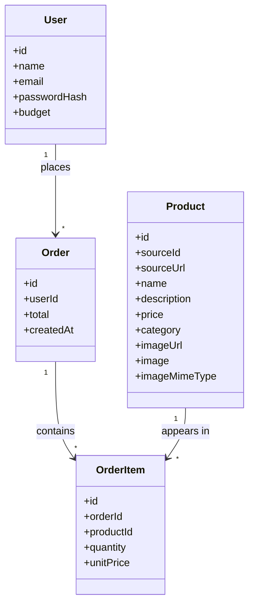

# Architecture

This document explains how the pieces of the app fit together. For *why*
these tools were chosen, see [CLAUDE.md](CLAUDE.md); this file is about
*how* they're wired up.

## High-level shape

```
Browser
  │
  │  clicks / form submits
  ▼
Next.js (single app, one process)
  ├─ Pages (Server Components)  — fetch data, render HTML
  ├─ Client Components          — interactive bits (forms, buttons, state)
  ├─ API routes (app/api/*)     — the only place that writes to the database
  ├─ proxy.ts (middleware)      — gate: are you logged in?
  └─ lib/                       — shared logic (auth, db, budget)
        │
        ▼
     Prisma Client
        │
        ▼
  SQLite file (prisma/dev.db)
```

There is no separate backend server or API host — Next.js serves the
HTML, runs the page-load logic, and handles API requests all from one
`npm run dev` process. That's the main simplifying idea behind the stack.

## Server Components vs. Client Components

This is the one distinction that matters most for understanding the code.

- **Server Components** (default in `app/`, e.g. `app/catalogue/page.tsx`,
  `app/orders/page.tsx`) run only on the server. They can talk to Prisma
  directly, read the session, and never ship their code to the browser.
  They're used purely to **fetch data**.
- **Client Components** (files starting with `"use client"`, e.g.
  `components/ProductCatalogue.tsx`, `components/OrdersView.tsx`,
  `components/NavBar.tsx`, `app/login/page.tsx`) run in the browser. They
  hold interactive state (quantity inputs, form fields) and are the only
  place `react-bootstrap` components can be rendered.

The pattern used throughout: a page.tsx **server component** fetches data
with Prisma, then passes it as props into a **client component** that
does the actual rendering with react-bootstrap.

```
app/catalogue/page.tsx (server)          app/orders/page.tsx (server)
  fetch products + budget                  fetch orders + budget
        │                                        │
        ▼                                        ▼
components/ProductCatalogue.tsx (client)  components/OrdersView.tsx (client)
  renders cards, tracks quantities,         renders spend summary,
  submits to /api/orders                    order history table
```

`react-bootstrap` doesn't ship a `"use client"` directive itself — trying
to render it from a Server Component throws "Element type is invalid".
That's why the split exists everywhere react-bootstrap is used.

## Request flow: placing an order

This is the core piece of business logic in the app.

1. User sets quantities in `ProductCatalogue.tsx` (client-side React
   state — nothing hits the server yet). The running total and a
   "remaining budget" figure are shown live, computed in the browser
   from the prices already sent down with the page.
2. Clicking **Place order** sends `POST /api/orders` with
   `{ items: [{ productId, quantity }] }`.
3. `app/api/orders/route.ts` (a server-only API route):
   - Confirms the caller is logged in (`auth()`), rejecting with 401
     otherwise.
   - Re-fetches the *authoritative* product prices from the database —
     it never trusts prices from the browser, only product IDs and
     quantities.
   - Computes the order total server-side.
   - Calls `getBudgetSummary()` (`lib/budget.ts`) to get the user's
     current remaining budget (their `budget` field minus the sum of
     `total` across all their past `Order` rows).
   - If the new total would exceed what's remaining, returns a 400 with
     an error message — no row is written.
   - Otherwise creates one `Order` row plus its `OrderItem` rows
     (snapshotting `unitPrice` at time of purchase) in a single Prisma
     call.
4. The client component redirects to `/orders` and calls
   `router.refresh()`, which re-runs the server component and shows the
   new remaining budget.

The same budget check happens twice, deliberately: once client-side (to
disable the button and give instant feedback) and once server-side (the
one that actually matters — the client-side check is only a UX nicety
and could be bypassed).

## Authentication

- **NextAuth.js (Auth.js) v5**, configured in `lib/auth.ts`, using the
  **Credentials provider** (email + password, no OAuth).
- Passwords are hashed with `bcryptjs` and stored on the `User` row
  (`passwordHash`); `authorize()` compares the submitted password against
  the hash.
- Sessions are JWT-based (no separate session table) — the user's `id`
  is copied into the token in the `jwt` callback, then back into
  `session.user.id` in the `session` callback, since NextAuth doesn't
  include it by default. `types/next-auth.d.ts` extends NextAuth's types
  so `session.user.id` type-checks.
- **`proxy.ts`** (Next.js 16.2's renamed `middleware.ts` convention) runs
  before every page request except `/api/auth/*` and static assets. It
  redirects logged-out users to `/login`, and redirects already-logged-in
  users away from `/login`. `app/page.tsx` (the `/` route) just
  redirects to `/catalogue` — the proxy has already ensured you're
  logged in by the time you get there.
- `components/Providers.tsx` wraps the whole app in NextAuth's
  `SessionProvider` so client components (like `NavBar`) can call
  `useSession()`/`signOut()`.

## Data model

Derived from the functional requirements in [requirements.md](requirements.md)
— a buyer, a catalogue, and the orders a buyer places against their
budget — and implemented in `prisma/schema.prisma` as four tables:



**In plain English:**

- **User** is the buyer — the requirements call for one buyer role, no
  admin/manager, so there's a single table rather than separate
  buyer/admin types. `budget` is the one fixed number everything else
  gets checked against; `passwordHash` (not a plaintext password) is
  what login checks against.
- **Product** is a single furniture item from the catalogue — its
  name, description, price, image, and category, i.e. everything the
  requirements say a buyer needs to see while browsing. Products are
  imported from an external MongoDB catalogue (`prisma/import-catalog.ts`)
  rather than hand-written; `sourceId`/`sourceUrl` trace each row back to
  its original MongoDB document, so re-running the import is an idempotent
  upsert rather than a duplicate insert. A product can come from either
  source: `imageUrl` holds an external image link (used by any
  hand-written/placeholder product), while `image`/`imageMimeType` hold
  the raw photo bytes for imported products, served through
  `app/api/products/[id]/image/route.ts` rather than embedded inline —
  see "Serving product images" below.
- **Order** is what gets created when a buyer submits a cart — one row
  per checkout, holding the total cost and when it happened. It belongs
  to exactly one User; a User can have many Orders (their history).
- **OrderItem** is one line within an order — "2 of the Oakwood Dining
  Table at $899 each." An Order needs this as a separate table (rather
  than one row per product) because a single order can contain several
  different products, each with its own quantity.
- `OrderItem.unitPrice` copies the product's price *at the moment of
  purchase*, rather than pointing back at `Product.price` live. This
  matters for the same reason a paper receipt doesn't change if the
  shop's prices go up tomorrow — past orders in the requirements'
  "order history" feature need to stay accurate forever.
- There's no separate "remaining budget" table — the requirement is
  satisfied by *deriving* it (`budget` minus the sum of the user's past
  `Order.total`s) every time it's needed, in `lib/budget.ts`, rather
  than storing a number that could drift out of sync.

Two things intentionally don't have their own table because the
requirements don't call for them yet: there's no `Cart` (quantities
only exist in the browser until checkout, per the "no persistent
server-side cart" scope note), and there's no `BudgetPeriod` (budget is
a single lifetime figure, not something that resets monthly — see the
open questions in requirements.md).

Migrations live in `prisma/migrations/`; the SQLite file itself
(`prisma/dev.db`) is git-ignored and regenerated locally with
`npx prisma migrate dev && npm run db:seed`.

### Serving product images

The imported catalogue's 762 product photos are real JPEGs (~60KB each,
~70MB total) stored as raw bytes in `Product.image`. Two things follow
from that:

- **The catalogue listing query never selects `image`.**
  `app/catalogue/page.tsx` uses an explicit `select` of just the fields
  the grid needs (name, price, category, etc.). Without that, loading the
  catalogue would pull ~70MB of image bytes into memory on every request
  just to list products — the point of `select` here isn't style, it's
  avoiding that.
- **Each `` points at its own route**, not an inline data URI:
  `lib/product.ts`'s `productImageSrc()` returns
  `/api/products/{id}/image` for any product without an external
  `imageUrl`. `app/api/products/[id]/image/route.ts` fetches just that
  one row's `image`/`imageMimeType` and streams it back with a
  long-lived `Cache-Control` header — so the browser loads 762 small
  image requests in parallel (normal `` behavior) instead of one
  enormous HTML response with all of them inlined.

## Directory reference

| Path | Role |
|---|---|
| `app/login/page.tsx` | Client component — login form, calls `signIn()` |
| `app/catalogue/page.tsx` | Server component — fetches products + budget |
| `app/orders/page.tsx` | Server component — fetches order history + budget |
| `app/api/auth/[...nextauth]/route.ts` | Delegates to NextAuth's handlers |
| `app/api/orders/route.ts` | The only route that writes `Order`/`OrderItem` rows |
| `app/api/products/[id]/image/route.ts` | Streams one product's photo bytes by id |
| `components/ProductCatalogue.tsx` | Client — quantity selection, live total, submits order |
| `components/OrdersView.tsx` | Client — renders order history + budget bar |
| `components/NavBar.tsx` | Client — top nav, shows session user, sign out |
| `components/Providers.tsx` | Client — wraps the app in NextAuth's `SessionProvider` |
| `lib/db.ts` | Shared Prisma client (single instance, reused across hot reloads) |
| `lib/auth.ts` | NextAuth configuration |
| `lib/budget.ts` | `getBudgetSummary()` — the one place remaining budget is computed |
| `lib/product.ts` | `productImageSrc()` — picks external `imageUrl` vs. the image route |
| `prisma/schema.prisma` | Data model |
| `prisma/seed.ts` | Demo user + 8 placeholder products (fallback if `import-catalog.ts` hasn't been run) |
| `prisma/import-catalog.ts` | Imports the real 762-item catalogue from MongoDB, replacing unused placeholders |
| `proxy.ts` | Route protection (login gate) |

## Deliberate non-features

Reflects the Day 1 hackathon scope in [CLAUDE.md](CLAUDE.md) — not
oversights:

- No persistent server-side cart — quantities live only in the
  catalogue page's React state until "Place order" is clicked.
- No payments/checkout.
- No multi-tenant/admin views, self-signup, or password reset.
- No budget periods/resets — `budget` is a single lifetime figure.
