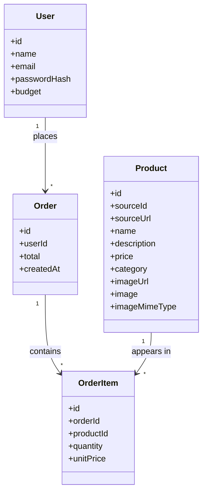

# Architecture

This document explains how the pieces of the app fit together. For *why*
these tools were chosen, see [CLAUDE.md](CLAUDE.md); this file is about
*how* they're wired up.

## High-level shape

```
Browser
  │
  │  clicks / form submits
  ▼
Next.js (single app, one process)
  ├─ Pages (Server Components)  — fetch data, render HTML
  ├─ Client Components          — interactive bits (forms, buttons, state)
  ├─ API routes (app/api/*)     — the only place that writes to the database
  ├─ proxy.ts (middleware)      — gate: are you logged in?
  └─ lib/                       — shared logic (auth, db, live catalogue/balance)
        │                    │
        ▼                    ▼
     Prisma Client      Cognitivo training API
        │                    (GET /catalogue/search-index,
        ▼                     GET /users/{user_id})
  SQLite file (prisma/dev.db)
```

There is no separate backend server or API host — Next.js serves the
HTML, runs the page-load logic, and handles API requests all from one
`npm run dev` process. That's the main simplifying idea behind the stack.
One exception: what's shown in the catalogue and the buyer's spendable
balance are *not* stored in our SQLite database — both are fetched live
from an external API each time they're needed (see "Live catalogue &
balance" below). Our own database still exists — it holds login accounts
and this app's own order history, plus a local mirror of products needed
to satisfy a foreign key (see below) — it just isn't the source of truth
for what's shown while browsing.

## Server Components vs. Client Components

This is the one distinction that matters most for understanding the code.

- **Server Components** (default in `app/`, e.g. `app/catalogue/page.tsx`,
  `app/orders/page.tsx`) run only on the server. They can talk to Prisma
  directly, read the session, and never ship their code to the browser.
  They're used purely to **fetch data**.
- **Client Components** (files starting with `"use client"`, e.g.
  `components/ProductCatalogue.tsx`, `components/OrdersView.tsx`,
  `components/NavBar.tsx`, `app/login/page.tsx`) run in the browser. They
  hold interactive state (quantity inputs, form fields) and are the only
  place `react-bootstrap` components can be rendered.

The pattern used throughout: a page.tsx **server component** fetches data
with Prisma, then passes it as props into a **client component** that
does the actual rendering with react-bootstrap.

```
app/catalogue/page.tsx (server)          app/orders/page.tsx (server)
  fetch products + live balance            fetch order history + live balance
        │                                        │
        ▼                                        ▼
components/ProductCatalogue.tsx (client)  components/OrdersView.tsx (client)
  renders cards, tracks quantities,         renders spend summary,
  submits to /api/orders                    order history table
```

`react-bootstrap` doesn't ship a `"use client"` directive itself — trying
to render it from a Server Component throws "Element type is invalid".
That's why the split exists everywhere react-bootstrap is used.

## Request flow: placing an order

This is the core piece of business logic in the app.

1. User sets quantities in `ProductCatalogue.tsx` (client-side React
   state — nothing hits the server yet), keyed by the Cognitivo `item_id`
   (e.g. `"00368814"`), not a local database id. The running total is
   computed in the browser from the prices already sent down with the
   page (fetched live from `search-index` when the page was
   server-rendered), and compared against the buyer's balance, also
   fetched live and passed down as a prop — the client does not call
   either external endpoint itself.
2. Clicking **Place order** sends `POST /api/orders` with
   `{ items: [{ itemId, quantity }] }`.
3. `app/api/orders/route.ts` (a server-only API route):
   - Confirms the caller is logged in (`auth()`), rejecting with 401
     otherwise.
   - Re-fetches the *authoritative* prices from `getSearchIndexProducts()`
     — it never trusts prices from the browser, only `item_id`s and
     quantities. Returns a 502 if that lookup itself fails.
   - For each item, resolves the local `Product` row via
     `sourceId: item_id` (creating one on the fly from the live catalogue
     entry if it doesn't exist yet) — needed because `OrderItem` has a
     database-level foreign key to `Product`, so *some* local row must
     exist even though the app no longer treats this table as the source
     of truth for browsing.
   - Computes the order total server-side.
   - Calls `getRealBalance()` (`lib/cognitivoApi.ts`) to get the buyer's
     current balance, fetched fresh (not cached) from the Cognitivo API.
   - If the new total would exceed that balance, returns a 400 with an
     error message — no row is written. If the balance request itself
     fails (timeout, non-200), returns a 502 rather than guessing.
   - Otherwise creates one `Order` row plus its `OrderItem` rows
     (snapshotting `unitPrice` at time of purchase) in a single Prisma
     call.
4. The client component does a full navigation to `/orders`, which
   re-renders the page from scratch and re-fetches the live balance.

The same balance check happens twice, deliberately: once client-side (to
disable the button and give instant feedback, using the balance already
fetched for the page) and once server-side (the one that actually
matters — the client-side check is only a UX nicety and could be
bypassed). Note that placing an order here only ever writes to our own
`Order`/`OrderItem` tables — it does not call the Cognitivo API's own
`POST /orders`, so the real balance is unaffected by orders placed
through this app. See "Live catalogue & balance" for why.

## Authentication

- **NextAuth.js (Auth.js) v5**, configured in `lib/auth.ts`, using the
  **Credentials provider** (email + password, no OAuth).
- Passwords are hashed with `bcryptjs` and stored on the `User` row
  (`passwordHash`); `authorize()` compares the submitted password against
  the hash.
- Sessions are JWT-based (no separate session table) — the user's `id`
  is copied into the token in the `jwt` callback, then back into
  `session.user.id` in the `session` callback, since NextAuth doesn't
  include it by default. `types/next-auth.d.ts` extends NextAuth's types
  so `session.user.id` type-checks.
- **`proxy.ts`** (Next.js 16.2's renamed `middleware.ts` convention) runs
  before every page request except `/api/auth/*` and static assets. It
  redirects logged-out users to `/login`, and redirects already-logged-in
  users away from `/login`. `app/page.tsx` (the `/` route) just
  redirects to `/catalogue` — the proxy has already ensured you're
  logged in by the time you get there.
- `components/Providers.tsx` wraps the whole app in NextAuth's
  `SessionProvider` so client components (like `NavBar`) can call
  `useSession()`/`signOut()`.

## Data model

Derived from the functional requirements in [requirements.md](requirements.md)
— a buyer, a catalogue, and the orders a buyer places against their
budget — and implemented in `prisma/schema.prisma` as four tables:



**In plain English:**

- **User** is the buyer — the requirements call for one buyer role, no
  admin/manager, so there's a single table rather than separate
  buyer/admin types. `passwordHash` (not a plaintext password) is what
  login checks against. `budget` is a leftover from before the balance
  came from the Cognitivo API (see "Live catalogue & balance" below) —
  nothing reads it anymore, but it hasn't been migrated away, since
  dropping a column is the kind of hard-to-reverse schema change this
  project's working conventions say to flag before doing.
- **Product** used to be where the app read catalogue data to display —
  it isn't anymore (browsing now reads live from the Cognitivo API — see
  below), but the table still exists and is still written to, purely so
  `OrderItem` has something to point its foreign key at. `sourceId` holds
  the Cognitivo `item_id`, which is how a live catalogue entry gets
  resolved to a local row when an order is placed. `imageUrl`/`image`/
  `imageMimeType` are leftover from an earlier iteration that displayed
  product photos (sourced from a one-time MongoDB import) — nothing
  reads them anymore, kept for the same reason `User.budget` is.
- **Order** is what gets created when a buyer submits a cart — one row
  per checkout, holding the total cost and when it happened. It belongs
  to exactly one User; a User can have many Orders (their history).
- **OrderItem** is one line within an order — "2 of the Oakwood Dining
  Table at $899 each." An Order needs this as a separate table (rather
  than one row per product) because a single order can contain several
  different products, each with its own quantity.
- `OrderItem.unitPrice` copies the product's price *at the moment of
  purchase*, rather than pointing back at `Product.price` live. This
  matters for the same reason a paper receipt doesn't change if the
  shop's prices go up tomorrow — past orders in the requirements'
  "order history" feature need to stay accurate forever. (It's also now
  the *only* record of that price locally, since `Product.price` is no
  longer treated as authoritative once a row exists.)
- There's no "remaining balance" table or column at all — see "Live
  catalogue & balance" immediately below.

There's no `Cart` table either, because quantities only exist in the
browser until checkout, per the "no persistent server-side cart" scope
note in requirements.md.

Migrations live in `prisma/migrations/`; the SQLite file itself
(`prisma/dev.db`) is git-ignored and regenerated locally with
`npx prisma migrate dev && npm run db:seed`.

### Live catalogue & balance

Both the product listing and the buyer's spendable balance are not
values we store — they're fetched live, on every page load and every
order attempt, from the Cognitivo training API (`lib/cognitivoApi.ts`):

- `getSearchIndexProducts()` — `GET /catalogue/search-index`, no auth
  header needed. Returns `item_id`/`product_name`/`price`/`category` (plus
  dimension/colour/image fields this app doesn't use) for every product.
  This is deliberately **not** the plain `GET /catalogue` endpoint, which
  returns full images for all 762 products and has been observed to hang
  indefinitely rather than respond — `search-index` exists specifically
  as the lightweight endpoint for browsing/search use cases.
- `getRealBalance()` — `GET /users/{user_id}`, authenticated with
  `x-api-key`. Its description says the balance "is derived by summing
  your bank.ledger credits and debits — it isn't a stored field," i.e.
  Cognitivo itself treats it as a live computation, not a snapshot — so
  this app does the same rather than keeping a second, potentially stale,
  copy of the truth.

Credentials (`COGNITIVO_BASE_URL` / `COGNITIVO_API_KEY` /
`COGNITIVO_USERNAME`) live in `.env` only, never committed.

Consequences worth knowing:

- **Both can be slow, and one can hang.** The balance endpoint has been
  observed taking several seconds (ledger aggregation, not a lookup);
  both it and `search-index` use a 15s timeout. `app/catalogue/page.tsx`
  and `app/orders/page.tsx` catch a failure and pass an error/`null` down
  rather than crashing the page; `ProductCatalogue.tsx` treats an
  unavailable balance as if it were over-budget (blocks ordering) rather
  than assuming either 0 or unlimited.
- **Orders placed in this app don't move the real balance.** `POST
  /api/orders` only writes to our own `Order`/`OrderItem` tables — it
  never calls the Cognitivo API's own `POST /orders`. So "Spent through
  this app" (shown on the orders page, derived from our own `Order` rows)
  and "Your balance" (live, external) are independent numbers by design
  of the current scope, not a bug. Wiring order placement through to the
  real ledger would be a separate, larger change.
- **Placing an order still needs a local `Product` row**, because of the
  `OrderItem` -> `Product` foreign key described above. `search-index`
  entries are keyed by `item_id`, which maps to `Product.sourceId`;
  `app/api/orders/route.ts` looks up (or creates, if missing) the local
  row by that key rather than by Prisma's own `Product.id`. This is the
  only place the local `Product` table still matters at request time.
  `prisma/import-catalog.ts` can still be used to pre-populate it from
  the same underlying dataset via MongoDB, but running it is now optional
  — the auto-create fallback means the app works without it.
- **No product photos are shown.** `search-index` returns `image_url:
  null` for every item (only the single-item `GET /catalogue/{item_id}`
  endpoint returns real image bytes, which this app doesn't call). The
  catalogue is rendered as a plain table of category/name/price/quantity
  rather than the image cards an earlier iteration had.

## Directory reference

| Path | Role |
|---|---|
| `app/login/page.tsx` | Client component — login form, calls `signIn()` |
| `app/catalogue/page.tsx` | Server component — fetches live catalogue + live balance |
| `app/orders/page.tsx` | Server component — fetches order history + live balance |
| `app/api/auth/[...nextauth]/route.ts` | Delegates to NextAuth's handlers |
| `app/api/orders/route.ts` | The only route that writes `Order`/`OrderItem` rows |
| `components/ProductCatalogue.tsx` | Client — quantity selection, live total, submits order |
| `components/OrdersView.tsx` | Client — renders order history + balance |
| `components/NavBar.tsx` | Client — top nav, shows session user, sign out |
| `components/Providers.tsx` | Client — wraps the app in NextAuth's `SessionProvider` |
| `lib/db.ts` | Shared Prisma client (single instance, reused across hot reloads) |
| `lib/auth.ts` | NextAuth configuration |
| `lib/cognitivoApi.ts` | `getSearchIndexProducts()` + `getRealBalance()` — live catalogue and balance from the Cognitivo API |
| `prisma/schema.prisma` | Data model |
| `prisma/seed.ts` | Demo user + 8 placeholder products (fallback; no longer used for browsing) |
| `prisma/import-catalog.ts` | Optional: pre-populates the local `Product` mirror from MongoDB |
| `proxy.ts` | Route protection (login gate) |

## Deliberate non-features

Reflects the Day 1 hackathon scope in [CLAUDE.md](CLAUDE.md) — not
oversights:

- No persistent server-side cart — quantities live only in the
  catalogue page's React state until "Place order" is clicked.
- No payments/checkout.
- No multi-tenant/admin views, self-signup, or password reset.
- No budget periods/resets — the balance is whatever the Cognitivo API
  reports right now, with no separate concept of a period or reset.
- Orders placed here don't call the Cognitivo API's `POST /orders` — see
  "Live catalogue & balance" above.
- No product photos, descriptions, or dimensions shown — the browsing
  endpoint used (`search-index`) doesn't return images, and the current
  spec for this view is category/name/price only.
